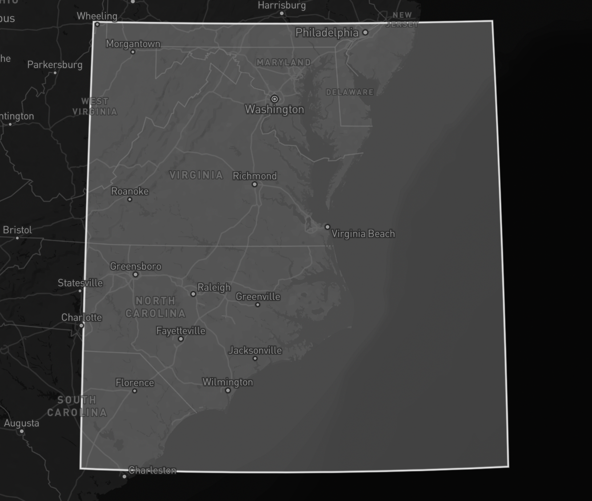

# NASRDiff

A diff report generator for the [FAA NASR](https://www.faa.gov/air_traffic/flight_info/aeronav/aero_data/NASR_Subscription/).
NASRDiff parses the files in the `28 Day Cycle CSV Change Report Files` product, 
generating a report for any additions, modifications, and deletions.

By adding a `filters.json` in the project root, the parser will filter the 
reports for the specified files, airports or heliports within those files, 
and/or a bounding box for items that are not specified by airport/heliport ID. 
An `example_filters.json` is present in the project root as a template.

```
Airport Base:
  Modifications:
    APH ::
        ARPT_NAME Change: MARY WALKER LZ -> AP HILL LZ (FORT AP HILL)
    FBG ::
        CITY Change: FORT LIBERTY -> FORT BRAGG
    LBT ::
        FUEL_TYPES Change: 100LL,A1+ -> 100LL,A1+,MOGAS
    MTN ::
        LAT_SEC Change: 32.381 -> 32.374
        LAT_DECIMAL Change: 39.32566138 -> 39.32565944
        LONG_SEC Change: 49.522 -> 49.545
        LONG_DECIMAL Change: -76.41375611 -> -76.4137625
        ELEV Change: 21.5 -> 22.2
        POSITION_SRC_DATE Change: 2011/04/21 -> 2024/11/22
        ELEVATION_SRC_DATE Change: 2011/04/21 -> 2024/11/22
    OBI ::
        LAST_INSPECTION Change: 2024/08/27 -> 2025/09/04
    OKV ::
        LAST_INSPECTION Change: 2022/06/28 -> 2025/09/11
    PHF ::
        LAST_INSPECTION Change: 2022/03/28 -> 2025/09/08
    PVG ::
        LAST_INSPECTION Change: 2022/06/06 -> 2025/08/26
    RMN ::
        LAST_INSPECTION Change: 2022/09/26 -> 2025/07/31
    VA39 ::
        ARPT_NAME Change: FORT GREGG-ADAMS AHP -> FORT LEE AHP

Fix Base:
  No changes

Navigation Base:
  No changes
```

## Requirements

- Python 3.11+

## Quick Start

- Clone this repository to a location of your choice using:
    - HTTPS: `https://github.com/misterrodg/NASRDiff.git`
    - SSH: `git@github.com:misterrodg/NASRDiff.git`
- Download the `28 Day Cycle CSV Change Report Files` from the `Current` or `Preview` 
page of the [FAA NASR](https://www.faa.gov/air_traffic/flight_info/aeronav/aero_data/NASR_Subscription/) page.
- Run with `python3 main.py -f text`
- View the resulting report files in the `./reports` directory.

For more detail and options, see [Usage](#usage).

## Usage

To find the NASR Change Report, go to the [FAA NASR](https://www.faa.gov/air_traffic/flight_info/aeronav/aero_data/NASR_Subscription/) page, 
select the `Current` or `Preview` page, search for `28 Day Cycle CSV Change Report Files`, 
and download the ZIP file. Since the `Current` and `Preview` pages have dates in 
the URL, it cannot be linked directly.

- Unzip the `28 Day Cycle CSV Change Report Files` and copy the `.csv` files into 
the `navdata` directory.
- Copy the `example_filters.json` as `filters.json`.
- Edit the `filters.json` to include the files, airports, and bounds of your choice 
(see [Filters](#filters), below).
- Run with `python3 main.py [args]` (see [Arguments](#arguments), below).

By default, a summary will be printed to the console. If a format is specified 
as an argument, the resulting reports will be in the `reports` directory.

### Arguments

| Short | Long | Action |
| - | - | - |
| `-a` | `--all` | Run for all files and all file content (ignores the `filters.json`). |
| `-c` | `--clear` | Clear files from navdata dir. |
| `-f` | `--format` | Sets the report format with options `console` (default) or `text`. |
| `-n` | `--norun` | Skip report generation. |
| `-p` | `--purge` | Purge files from reports dir. |
| `-s` | `--show` | Show filters in console. |
| `-v` | `--verbose` | Show record details. |

### Filters

| Field | Description |
| - | - |
| `files` | An array of strings representing the initial part of a change report filename (everything up to `_CHG_RPT.csv`). Set this to select the files that contain data that you are interested in. |
| `bounds` | An object with the next four fields. |
| `n_lat` | The northernmost latitude boundary in decimal form. |
| `s_lat` | The southernmost latitude boundary in decimal form. |
| `w_lon` | The westernmost longitude boundary in decimal form. |
| `e_lon` | The easternmost longitude boundary in decimal form. |
| `artccs` | An array of strings representing the ARTCC code of the ARTCCs that you are interested in. |
| `airports` | An array of strings representing the FAA code* of the airports (and heliports) that you are interested in. |
| `airways` | An array of strings representing the Airway ID of the airways that you are interested in. |

\* The FAA Code is a three-letter identifier, commonly mistaken for an IATA 
code since they are usually the same. Generally, it is the ICAO code without the 
initial `K`. There are some oddities that exist, such as Manassas, VA, which 
uses `ICAO: KHEF`, `FAA: HEF`, and `IATA: MNZ`. If you are unsure, download the 
full NASR product, open the `APT_BASE.csv` file, and search for the facility by 
name. Use the value from the `ARPT_ID` in the `airports` array.

#### Example

The example provided in `example_filters.json` sets filters for:

- `files`: `"APT_BASE"`, `"FIX_BASE"` and `"NAV_BASE"`. This selects only these 
three files. The rest are ignored.
- `bounds`: `"n_lat": 40.1`, `"s_lat": 32.9`, `"w_lon": -80.8`, and `"e_lon": -72.5`. 
This selects anything defined by a lat/lon position in the area that is shown 
in the image below.
- `artccs`: `"ZDC"`. This selects only this ARTCC. The rest are ignored.
- `airports`: `"ADW"`, `"BWI"`, `"DCA"`, and `"IAD"`. This selects only these 
airports. The rest are ignored.
- `airways`: `"J110"`, `"J149"`, `"J162"`, `"J211"`. This selects only these 
airways. The rest are ignored.



## Motivation

Aviation data has the potential to change every 28 days. The FAA has thankfully 
provided the files that contain only the changed between each cycle, but those 
files contain every change across the National Airspace System (NAS). Having a 
utility to filter those changes down to only what is relevant helps you save 
time and stay up to date.

I made this primarily for myself, but it can be used by anyone who has an 
interest in aviation data and a basic understanding of python.

## Contributing

Interested in helping make this project better? It's a small project, so the 
process is rather informal:

- Clone this repo to your development machine.
- Make your changes in a branch.
- Open a PR with your suggested changes.

Need ideas on what needs work? Have a look at the [Issues](https://github.com/misterrodg/NASRDiff/issues) page.

